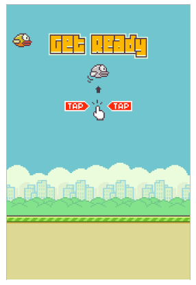

# FlappyByrd-JS
Após assistir o começo do tutorial do [Dev Soltinho](https://youtu.be/jOAU81jdi-c) ensinando a fazer o viciante FlappyBird totalmente em Javascript, empolguei para fazer junto e aprender mais sobre canvas.
<h1 align="center">
    
</h1>

### Aprendizado
O canvas é incrível. Desenhar, animar e colidir od objetos desenhados foi um desafio, pois o Dev Soltinho quase sempre explica o que quer fazer antes de fazer de fato e eu me desafiei a tentar fazer antes de ver o que ele iria fazer. Foi a melhor decisão que poderia ter tomado, em muitos momentos eu consegui fazer a lógica sozinho, o que pra mim é importante ver que evoluí muito como programador.
Algumas lógicas são bem complexas, mas foi interessante ver que jogos nessecitam de uma complexidade matemática bem interessante.
